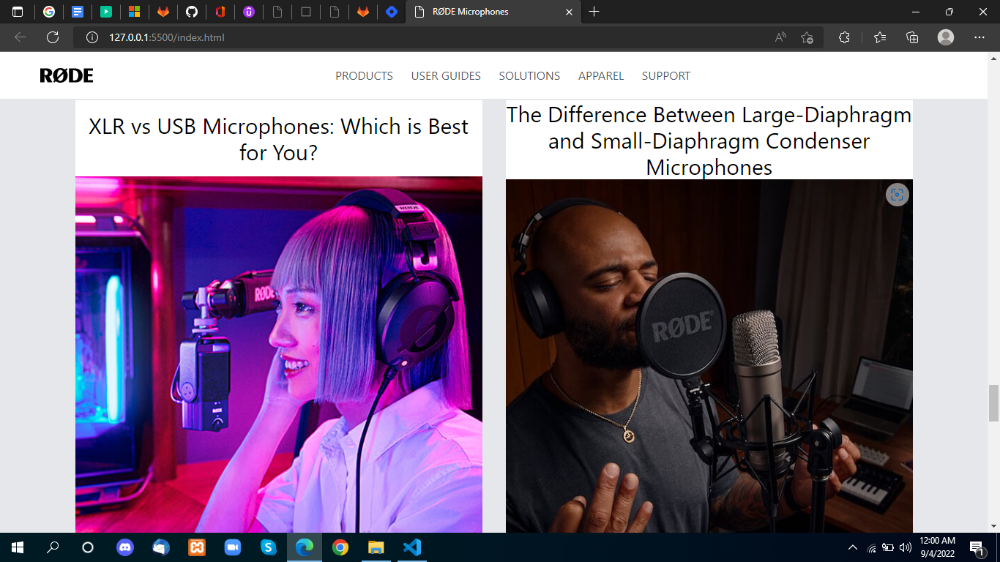

# Project-17 Rode Clone

 

## Project live link
[https://my-rodeclone.netlify.app/](https://my-rodeclone.netlify.app/ "rode.com")

## Screenshot

 

## project Type
- Rode Clone- multiple components. 
- UI Design with mobile responsive.

## My learning from this Project
- Tailwind classes
- Tailwind class properties nav sticky 
- flex-box in tailwind
- Background Images Class
- Grid in tailwind
- Imges Properties 
- Responsive Classes
- Colors and tailwind config theme
- Lots of small things I learn from making this project in tailwind

## Time to make this project
#### Approx 9 hour to make
